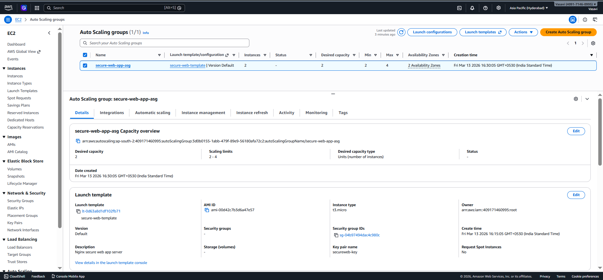

# 🚀 Secure & Scalable Web Application on AWS

A **cloud-native web application architecture** deployed on AWS demonstrating **high availability, scalability, and secure networking** using industry best practices.

This project implements a **production-style architecture** using:

- Amazon EC2
- Application Load Balancer
- Auto Scaling Group
- Amazon RDS MySQL
- AWS VPC Networking
- Nginx Web Server

---

# 📌 Project Overview

This project demonstrates how to deploy a **secure and scalable web application infrastructure** on AWS following modern cloud architecture patterns.

The system design focuses on:

- High Availability
- Horizontal Scalability
- Secure Network Isolation
- Multi-AZ Fault Tolerance

### Infrastructure Components

The architecture includes:

- **AWS VPC** for isolated networking
- **Public Subnet** for the Application Load Balancer
- **Private Subnets** for EC2 instances
- **Auto Scaling Group** for dynamic scaling
- **Nginx Web Servers** running on EC2
- **Amazon RDS MySQL (Multi-AZ)** for database high availability

---

# 🏗 Architecture Diagram


---

# 🔁 Architecture Flow

```
Users / Internet
        ↓
Application Load Balancer
        ↓
Auto Scaling Group
   ├── EC2 Instance A
   └── EC2 Instance B
        ↓
RDS MySQL Database (Primary + Standby)
```

This architecture ensures:

- Load balanced traffic distribution
- Automatic scaling based on demand
- High availability across multiple Availability Zones
- Secure database layer inside private subnets

---

# 🌐 Website Demo

Example output of the deployed application:


---

# 📷 AWS Infrastructure Screenshots

### EC2 Instance Dashboard


---

### Application Load Balancer


---

### Auto Scaling Group


---

### RDS MySQL Database


---

### Target Group Configuration


---

# 🛠 Technologies Used

| Technology | Purpose |
|------------|---------|
| **AWS EC2** | Compute instances for web servers |
| **Application Load Balancer** | Distributes incoming traffic |
| **Auto Scaling Group** | Automatically scales EC2 instances |
| **Amazon RDS MySQL** | Managed relational database |
| **AWS VPC** | Network isolation |
| **Nginx** | Web server |
| **HTML / CSS** | Frontend interface |

---

# ⭐ Key Features

- Multi-AZ high availability
- Auto scaling infrastructure
- Secure VPC network architecture
- Load-balanced web servers
- Private database subnet isolation
- Fault-tolerant cloud architecture

---

# 🌍 Deployment Region

```
AWS Region: ap-south-2 (Hyderabad)
```

---

# 👩‍💻 Author

**Vasavi**

Computer Science Student  
Cloud & Web Technologies Enthusiast

