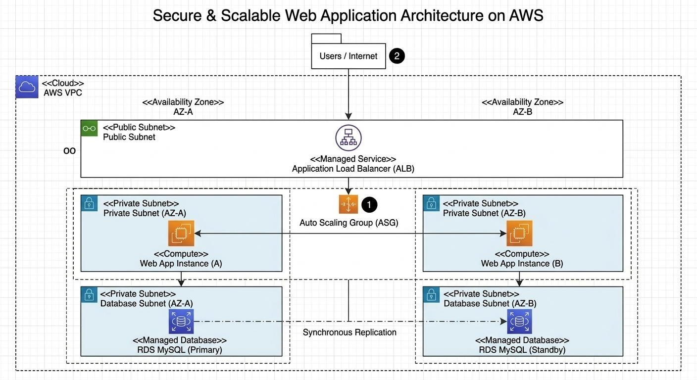
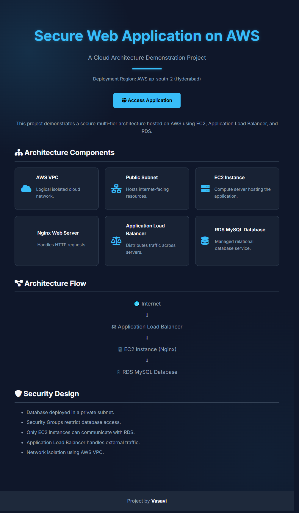
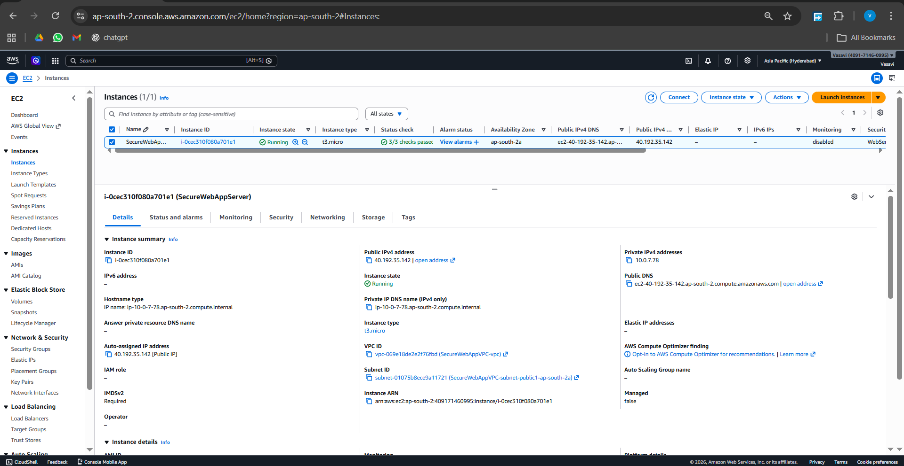
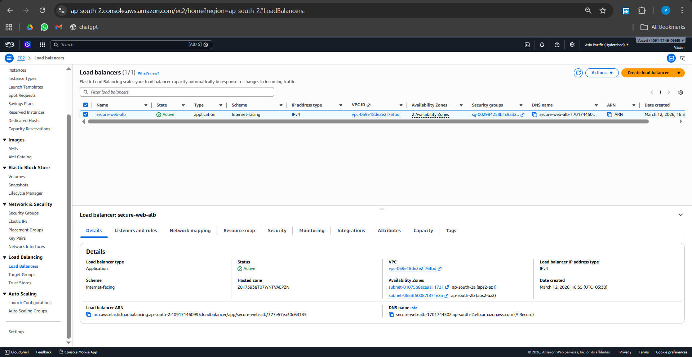
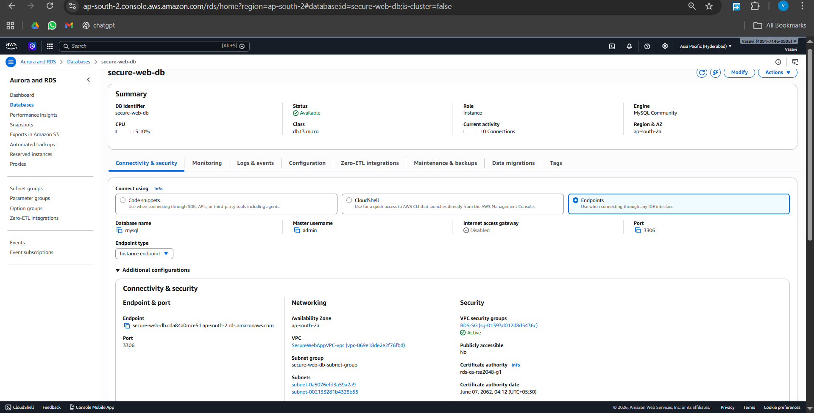
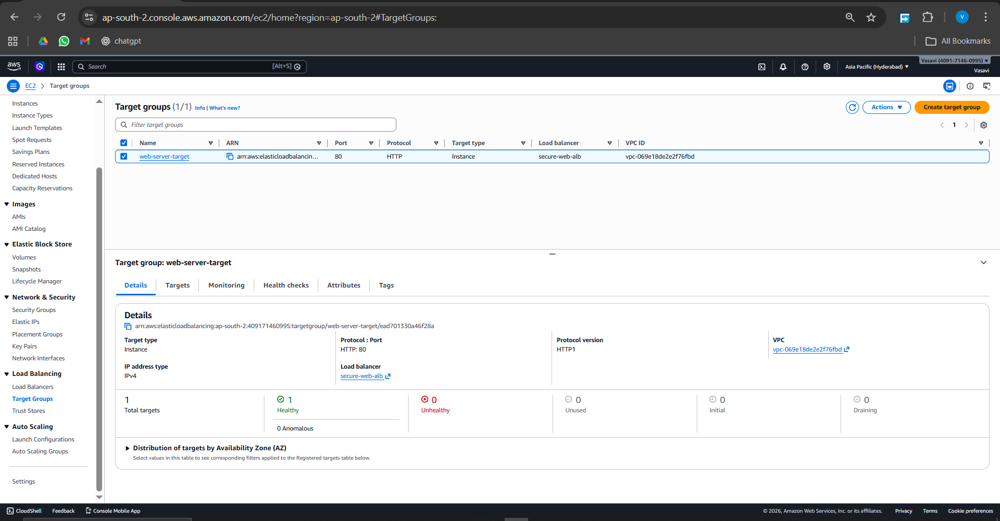

# Secure & Scalable Web Application on AWS

This project demonstrates a **secure and scalable cloud architecture deployed on AWS** using EC2, Application Load Balancer, Auto Scaling, and RDS MySQL.

---

# Project Overview

This system deploys a web application on AWS following best practices for:

- High availability
- Scalability
- Secure networking
- Multi-AZ architecture

The infrastructure includes:

- AWS VPC
- Public and Private Subnets
- Application Load Balancer
- EC2 Auto Scaling Group
- Nginx Web Server
- Amazon RDS MySQL (Multi-AZ)

---

# Architecture Diagram



---

# Architecture Flow

```
Users / Internet
        ↓
Application Load Balancer
        ↓
Auto Scaling Group
   ├── EC2 Instance A
   └── EC2 Instance B
        ↓
RDS MySQL Database (Primary + Standby)
```

---

# Website Demo

Example output of the deployed application:



---

# AWS Infrastructure Screenshots

### EC2 Instances


### Application Load Balancer


### Auto Scaling Group


### RDS Database


### Target groups


---

# Technologies Used

- AWS EC2
- AWS Application Load Balancer
- AWS Auto Scaling
- AWS RDS MySQL
- AWS VPC Networking
- Nginx Web Server
- HTML / CSS

---

# Key Features

- Multi-AZ high availability
- Auto scaling infrastructure
- Secure VPC architecture
- Load balanced web servers
- Private database layer

---

# Deployment Region

```
AWS Region: ap-south-2 (Hyderabad)
```

---

# Author

**Vasavi**

Computer Science Student  
Cloud & Web Technologies Enthusiast

---

# Future Improvements

- Infrastructure as Code (Terraform)
- CI/CD deployment pipeline
- Monitoring using CloudWatch
- HTTPS with AWS Certificate Manager
